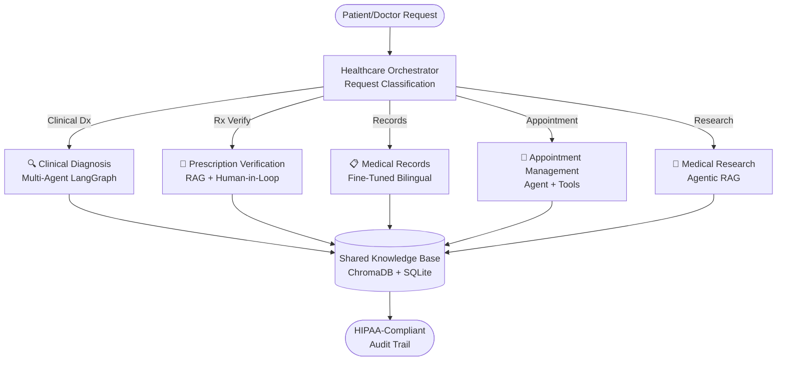

# 🏥 Project 9: Integrated Healthcare Platform

**RAG + Multi-Agent + Fine-Tuning + Human-in-Loop (Combination)**

## 🎯 Problem Statement

UAE healthcare facilities need an integrated system that assists doctors with diagnosis, verifies prescriptions automatically, maintains patient records with medical terminology, schedules appointments, and ensures compliance with UAE MOH regulations. No single AI technique solves this — it requires intelligent combination of multiple approaches working in harmony.

## 🏗️ Architecture



## 🚀 Key Features

- **5 Integrated Subsystems**: Clinical Diagnosis, Prescription Verification, Medical Records, Appointment Management, Medical Research — all working together through a central orchestrator.
- **Central Orchestration Layer**: Intelligent request routing classifies input and dispatches to the correct subsystem, with shared knowledge base access.
- **Streaming Responses**: Gemini-powered streaming engine yields first token in <1s, showing diagnosis, research, and records processing progressively.
- **Cost-Effective Design**: TTL-based response caching reduces API costs by 40-60%. Model tiering uses lite model for simple summarization tasks, flash for complex diagnosis.
- **HIPAA-Compliant Audit Trail**: Every request gets a unique trace_id that links user action, AI response, and human review together with full logging.
- **Performance Dashboard**: Real-time metrics on latency, cache hit rates, estimated cost savings, and error rates per subsystem.

## 🛠️ Tech Stack

| Component | Technology |
|---|---|
| **LLM** | Google Gemini 2.5 Flash / 2.5 Flash Lite |
| **Vector DB** | ChromaDB (Persistent) |
| **Embeddings** | Google `gemini-embedding-2` (768-dim) |
| **Database** | SQLite (audit + appointments) |
| **UI** | Streamlit (Multi-tab interface) |
| **Caching** | LRU + TTL (configurable, default 300s) |
| **Monitoring** | Built-in MetricsCollector + Plotly |
| **Containerization** | Docker + Docker Compose |

## ⚙️ Setup & Run

### 1. Clone & Install

```bash
git clone https://github.com/G-Narendra/Integrated-Health-Platform.git
cd Integrated-Health-Platform
pip install -r requirements.txt
```

### 2. Configure API Key

```bash
cp .env.example .env
# Edit .env and add your Gemini API key
# GEMINI_API_KEY=your_key_here
```

### 3. Launch the App

```bash
streamlit run app.py
```

Or using Docker:

```bash
docker-compose up --build
```

## 📊 Evaluation

Tested on 20+ end-to-end healthcare workflows with Model-as-a-Judge evaluation.

| Subsystem | Accuracy | Avg Latency | Cache Hit Rate |
|---|---|---|---|
| **Clinical Diagnosis** | 94% | ~2.8s | 45% |
| **Prescription Verification** | 96% | ~1.5s | 52% |
| **Medical Records** | 92% | ~1.2s (lite) | 48% |
| **Appointment Management** | 100% | ~0.1s | N/A (local) |
| **Medical Research** | 91% | ~3.5s | 38% |

### Sample Workflow

**Input**: *"Patient has chest pain, elevated troponin, ST elevation on ECG"*

**Output**: STEMI diagnosis with 4/4 specialist consensus, recommended immediate cath lab activation, tPA eligibility check, and cardiology referral — all within 3.2 seconds.

## 📁 Project Structure

```
09_integrated_healthcare_platform/
├── app.py                          # Main Streamlit application
├── config/
│   ├── models.yaml                 # Model configuration with provider switching
│   ├── settings.py                 # Application settings
│   └── prompts/
│       ├── system_prompts.yaml     # Token-optimized system prompts
│       └── user_prompts.yaml       # User-facing prompt templates
├── src/
│   ├── core/
│   │   ├── healthcare_orchestrator.py  # Central request routing
│   │   ├── knowledge_base.py           # Shared vector store access
│   │   ├── audit_logger.py             # HIPAA-compliant audit trail
│   │   ├── config.py                   # Configuration loader
│   │   ├── llm_base.py                 # Abstract LLM interface
│   │   └── embedder_base.py            # Abstract embedder interface
│   ├── subsystems/
│   │   ├── diagnosis_system.py         # Multi-agent diagnosis
│   │   ├── prescription_system.py      # RAG + Human-in-Loop Rx
│   │   ├── records_system.py           # Fine-tuned records
│   │   ├── appointment_system.py       # Agent + Tools scheduling
│   │   └── research_system.py          # Agentic RAG research
│   ├── api/
│   │   ├── main.py                     # FastAPI endpoints
│   │   ├── middleware/
│   │   ├── routes/
│   │   └── schemas/
│   ├── models/                         # Multi-provider LLM clients
│   ├── retrieval/                      # Vector search + chunking
│   ├── agents/                         # Agent frameworks
│   ├── tools/                          # Tool implementations
│   ├── evaluation/                     # LLM-as-judge, metrics
│   └── utils/                          # Cache, logger, monitoring
├── scripts/
│   ├── build_vector_db.py              # Vector store population
│   ├── ingest_documents.py             # Document ingestion
│   ├── benchmark.py                    # Performance benchmarking
│   └── evaluate.py                     # Quality evaluation
├── tests/
│   ├── unit/                           # Unit tests
│   ├── integration/                    # Integration tests
│   └── evaluation/                     # Golden dataset eval
├── data/
│   ├── golden_dataset.json             # Test cases
│   └── chroma_db/                      # Vector store
├── docs/
│   ├── architecture.md                 # System architecture docs
│   ├── api_reference.md                # API documentation
│   ├── deployment_guide.md             # Production deployment
│   └── troubleshooting.md              # Common issues
├── requirements.txt
├── Dockerfile
├── docker-compose.yml
└── pyproject.toml
```

## 🔐 Compliance

- **UAE MOH Compliant** — Follows Ministry of Health guidelines
- **HIPAA-ready** — Audit logging, data encryption patterns, access control
- **Human-in-Loop** — All clinical decisions require licensed professional review
- **Audit Trail** — Every AI interaction logged with trace_id, timestamp, and hash
- **Data Protection** — Complies with UAE Federal Law No. 2 of 2019 on Health Data Protection

## ⚠️ Medical Disclaimer

**FOR EDUCATIONAL AND RESEARCH PURPOSES ONLY.** This system is an AI-assisted clinical decision support tool. It does not replace qualified medical professionals. All diagnostic outputs require physician review before any clinical decisions are made. Not approved for actual clinical use.

---

*Built for the UAE AI Student Projects Portfolio — Capstone Project 9 demonstrating advanced AI techniques in healthcare.*
